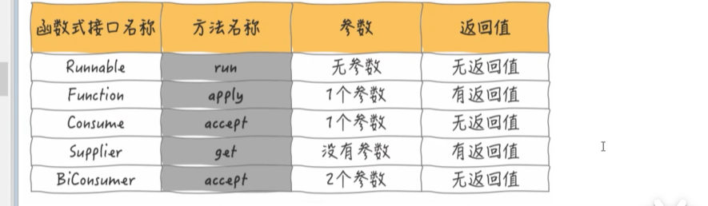

# 模块架构
* yljphone-platform:架构平台统一父工程(管理子模块，管理所有的依赖版本、管理相关插件....)
    * yljphone-ability: 能力服务模块(存放一些非业务相关的微服务，比如说网关、身份认证服务等等)
    * yljphone-business: 业务服务模块(存放一些业务相关的微服务，比如订单、积分等等)
        * yljphone-business-core: 微服务核心模块(SpringBoot工程，微服务核心运行模块)
        * yljphone-business-feign: 微服务核心调用模块(Feign接口,当前微服务提供给其他微服务调用的模块)
    * yljphone-commons: 架构核心工具模块(根据不同的框架功能，划分不同的模块)
        * yljphone-commons-core: 非web环境核心工具模块
        * yljphone-commons-web: web环境核心工具模块
    * yljphone-config: 本地统一配置文件管理模块(管理微服务的统一配置信息，多环境控制)
    * yljphone-data: 架构数据管理模块
        * yljphone-data-entity: 实体类的相关管理
        * yljphone-data-mapper: mybatis映射文件管理
    * yljphone-job: 分布式任务调度中心，集成xxl-job，可支持定制化操作

